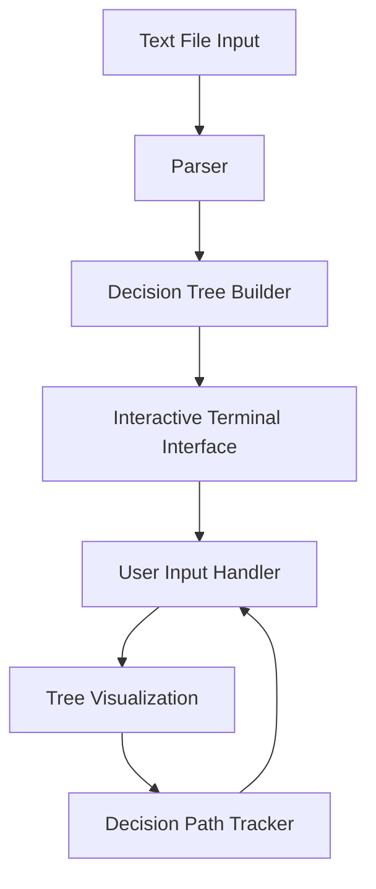

1# Anthropic Approach to Building a Generic Decision Tree

This document outlines our approach to building a generic decision tree system that can process structured text files and present an interactive, visual decision-making experience in the terminal.

## Core Design Principles

1. **Simplicity**: The implementation focuses on core functionality with minimal dependencies
2. **Flexibility**: The system can handle any decision tree content, not just food safety
3. **Usability**: Clear terminal-based visualization and intuitive navigation
4. **Extensibility**: The design allows for future enhancements

## System Architecture

The decision tree system consists of the following components:



### 1. Parser
Reads the text file and converts it into a structured representation of questions, answers, and results.

### 2. Decision Tree Builder
Constructs the tree data structure from the parsed content, establishing the relationships between nodes.

### 3. Interactive Terminal Interface
Presents questions to the user and displays the decision path visually.

### 4. User Input Handler
Processes user commands and navigates through the tree based on selections.

### 5. Tree Visualization
Renders the current decision path as an ASCII tree in the terminal.

### 6. Decision Path Tracker
Maintains the history of questions and answers for visualization and potential export.

## Text File Format

We chose a simple, line-based format for defining decision trees:

```
Q1: First question text
A: Answer option 1 -> Q2
A: Answer option 2 -> R1

Q2: Second question text
A: Answer option 1 -> Q3
A: Answer option 2 -> R2

R1: RESULT: First result text
R2: RESULT: Second result text
```

This format is:
- Easy to read and write
- Intuitive for non-technical users
- Flexible enough to represent complex decision trees
- Parsable with simple regular expressions

## Implementation Details

### Node Class
Represents a single question or result in the decision tree:
- Stores the node ID, text content, and whether it's a result
- Maintains a list of possible answers and their destinations

### DecisionTree Class
Manages the overall tree structure and navigation:
- Stores all nodes in a dictionary for quick access
- Tracks the current path through the tree
- Provides methods for navigating forward and backward
- Generates a visual representation of the current path

### Parser Function
Processes the text file and builds the tree:
- Uses regular expressions to identify questions, answers, and results
- Creates nodes and establishes connections between them
- Validates the tree structure for consistency

### User Interface
Provides an interactive terminal experience:
- Displays questions and numbered options
- Shows the decision path as an ASCII tree
- Supports navigation commands (back, restart, tree, exit)
- Presents final results with the complete decision path

## Error Handling

The implementation includes robust error handling:
- File not found errors
- Invalid file format detection
- Navigation validation
- User input validation

## Visualization Approach

We use ASCII/Unicode characters to create a visual tree representation:
```
Your current decision path:
└── Is the food stored at the proper temperature?
    └── Yes
        └── Has the food been cooked to the appropriate internal temperature?
            └── [Awaiting your answer]
```

This approach:
- Works in any terminal
- Clearly shows the hierarchy of decisions
- Highlights the current position in the tree
- Requires no external dependencies

## Sample Application: Food Safety Evaluation

We created a comprehensive food safety evaluation decision tree that:
- Covers key food safety parameters (temperature, cooking, storage, handling)
- Provides detailed explanations for results
- Includes branching paths for different scenarios
- Is based on established food safety guidelines

## Enhanced Output Format

We've implemented several enhancements to the output format:

1. **Markdown-based Output Files**:
   - Decision paths are saved as Markdown (.md) files instead of plain text
   - This provides better compatibility with documentation systems and version control
   - Markdown is widely supported and can be viewed in many editors and platforms

2. **Input File Name in Output**:
   - The output filename includes the input file name (e.g., food_safety_decision_path_TIMESTAMP.md)
   - This creates a clear connection between input and output files
   - Makes it easier to manage multiple decision paths from different input files

3. **Mermaid Diagram Integration**:
   - Each saved file includes a Mermaid diagram representing the decision path
   - Provides a visual flowchart representation that complements the text-based tree
   - When viewed in compatible Markdown viewers (like GitHub), the diagram renders as an interactive flowchart

### Rationale for Markdown Format

Markdown was chosen for several reasons:
- **Rich Formatting**: Supports headers, lists, code blocks, and other formatting that enhances readability
- **Wide Compatibility**: Viewable in text editors, IDEs, documentation systems, and web platforms
- **Version Control Friendly**: Works well with Git and other version control systems
- **Extensibility**: Supports extensions like Mermaid diagrams for enhanced visualization

### Benefits of Mermaid Diagrams

Mermaid diagrams offer significant advantages:
- **Visual Clarity**: Makes complex decision paths easier to understand at a glance
- **Interactive Viewing**: When rendered in compatible viewers, diagrams can be zoomed, panned, and interacted with
- **Accessibility**: Provides an alternative representation for users who prefer visual formats
- **Professional Documentation**: Enhances the quality of saved outputs for reporting or sharing

## Future Enhancements

The system could be further extended with:
1. Support for more complex decision logic (e.g., conditional branching based on multiple factors)
2. Ability to resume decision paths from saved files
3. Additional visualization formats (e.g., SVG, PNG export)
4. Support for weighted decisions or probability
5. Integration with other documentation systems

## Conclusion

This implementation demonstrates a clean, effective approach to building a generic decision tree system. By focusing on simplicity and usability, we've created a tool that can be applied to a wide range of decision-making scenarios while providing a visual and interactive experience.
