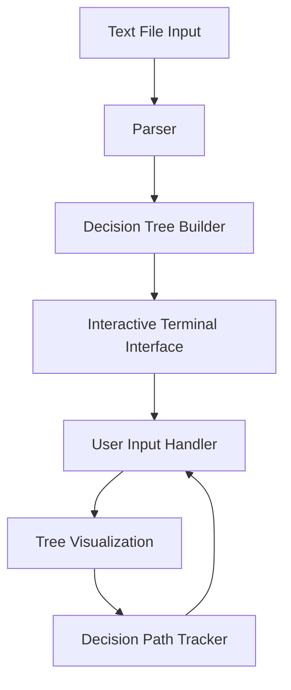

# Decision Tree Navigator - Development Chat History

This document contains the planning conversation that led to the development of the Decision Tree Navigator.

## Initial Request

**User:** I want you to create a simple and visual implementation of a decision tree. A python script will digest a text file. The text file will be instructions for doing something. Create a sample text file: how to evaluate food safety. User will pass the text file to the python script as an argument. The output will be a series of terminal based questions. The user will be able to see all questions and answers previously given in the terminal as a tree of decisions.

## Planning Phase

### Understanding Requirements

**Assistant:** I'll help you create a decision tree implementation in Python that processes a text file of instructions and presents interactive questions in the terminal. Before I create a detailed plan, I need to understand one key aspect:

How would you like to structure the text file that contains the decision tree instructions? For example:
- A simple format with questions and possible answers on each line
- A hierarchical format with indentation to represent the tree structure
- A more complex format with tags or markers to indicate questions, answers, and branches
- JSON or YAML format for more structured data

This will help me design the parser and overall implementation more effectively.

**User:** Simple format with questions and possible answers on each line

### Research on Food Safety

The assistant conducted research on food safety evaluation using Perplexity to gather information about hierarchical decision trees for evaluating food safety. This research covered:

- Core decision tree structure
- Hazard identification
- Critical Control Point (CCP) determination
- Risk prioritization and control
- Monitoring and verification
- Adaptive management
- Contextual considerations

### Detailed Implementation Plan

**Assistant:** 

# Anthropic Approach to Building a Generic Decision Tree

## 1. Overview
I'll create a Python-based decision tree system that reads a simple text file containing questions and answers, presents these questions to the user in the terminal, and visualizes the decision path as a tree structure. This implementation will be generic enough to work with any decision tree content, with a food safety evaluation example as our demonstration case.

## 2. Text File Format Design
For the simple format with questions and possible answers on each line, I propose the following structure:

```
Q: [Question text]
A: [Answer option 1] -> [Next question ID or RESULT]
A: [Answer option 2] -> [Next question ID or RESULT]
...
Q: [Next question text with ID]
...
```

Example:
```
Q1: Is the food properly stored at the correct temperature?
A: Yes -> Q2
A: No -> R1
Q2: Has the food been cooked to the appropriate internal temperature?
A: Yes -> Q3
A: No -> R2
...
R1: RESULT: The food is unsafe. Improper storage temperatures can allow bacteria to multiply.
R2: RESULT: The food is unsafe. Proper cooking temperatures are required to kill harmful bacteria.
```

## 3. System Architecture



## 4. Implementation Components

### 4.1 Parser Module
- Read the text file line by line
- Parse questions and their associated answers
- Build a dictionary/graph representation of the decision tree

### 4.2 Decision Tree Class
- Store questions, answers, and their relationships
- Navigate through the tree based on user input
- Track the current position in the tree

### 4.3 Terminal UI
- Display current question and answer options
- Visualize the decision path taken so far as a tree
- Handle user input for selecting answers
- Show final results

### 4.4 Tree Visualization
- Use ASCII/Unicode characters to draw the tree structure
- Show the current path highlighted
- Display previous questions and selected answers

## 5. Sample Food Safety Evaluation Text File
Based on the information gathered, I'll create a comprehensive food safety evaluation decision tree covering:
- Storage temperature checks
- Cooking temperature verification
- Cross-contamination assessment
- Expiration date verification
- Visual inspection criteria
- Handling procedures

## 6. Python Implementation Details

### 6.1 Key Classes and Functions
- `DecisionTree`: Main class to represent the tree structure
- `Node`: Class to represent questions and answers
- `parse_file()`: Function to read and parse the input file
- `display_tree()`: Function to visualize the current state of the tree
- `get_user_input()`: Function to handle user selections
- `navigate_tree()`: Function to move through the tree based on user input

### 6.2 Libraries to Use
- Standard Python libraries only (no external dependencies):
  - `sys`: For command-line arguments
  - `os`: For file operations
  - `re`: For text parsing

## 7. User Experience
1. User runs the script with a text file as an argument: `python decision_tree.py food_safety.txt`
2. The terminal displays the first question with numbered options
3. User selects an option by entering a number
4. The terminal updates to show:
   - The decision path so far as a tree
   - The next question with its options
5. Process continues until a final result is reached
6. User can restart or exit

## 8. Implementation Plan
1. Create the parser to read the text file format
2. Build the decision tree data structure
3. Implement the terminal UI for displaying questions
4. Develop the tree visualization component
5. Create the sample food safety evaluation text file
6. Add user input handling and navigation
7. Test with various decision trees
8. Add error handling and edge cases

## 9. Potential Enhancements
- Support for more complex decision logic
- Ability to save/resume decision paths
- Export results to a file
- Support for multimedia content (if needed in the future)

### Error Logging Strategy

A comprehensive error logging approach was added to the plan:

1. Error Types and Handling
   - File Processing Errors
   - Decision Tree Structure Errors
   - Runtime Errors

2. Logging Implementation
   - Logging Levels
   - Logging Mechanism

3. Error Recovery Strategies
   - Graceful Degradation
   - User Feedback
   - Automatic Correction

4. Error Reporting
   - Log File Management
   - Error Statistics

5. Integration with Main Components

### User Instructions and Onboarding Experience

A detailed user onboarding experience was planned:

1. Command-Line Interface Instructions
2. Welcome Screen
3. Interactive Guidance
4. Decision Path Visualization
5. Results Display
6. Error Messages
7. Progress Indicators

### Decision Path Export and Graph Generation

Functionality to save decision paths and generate visualizations:

1. Decision Path Export (JSON, Markdown, CSV, DOT formats)
2. Graph Generation
   - Built-in Visualization
   - External Graph Generation (Graphviz, Mermaid.js)
   - HTML Report

## Simplified POC Approach

Based on user feedback, the plan was simplified to a minimal Proof of Concept:

### Minimal File Structure (3 files total)
1. `decision_tree.py` - Main Python script containing all functionality
2. `food_safety.txt` - Sample decision tree content file
3. `README.md` - Basic documentation and usage instructions

### Core Features for POC
1. Command-line Interface
2. Interactive Navigation
3. Minimal Visualization
4. Basic Error Handling
5. Optional: Simple Export

Additional files were later added to include:
4. `chat_history.md` - Complete history of our planning conversation
5. `food_safety_research.md` - The Perplexity research on food safety evaluation

## Implementation

The user toggled to Act mode, and the implementation began with creating the five files as planned.

## Final Result

The final implementation includes:

1. A Python script (`decision_tree.py`) that reads a decision tree from a text file and presents an interactive terminal-based interface
2. A sample food safety evaluation decision tree (`food_safety.txt`)
3. Documentation (`README.md`)
4. Research on food safety evaluation (`food_safety_research.md`)
5. Development history (`chat_history.md`)

The implementation allows users to navigate through a decision tree, see their path visualized as a tree structure, and get results based on their answers.

## Enhancement Phase

After the initial implementation, several enhancements were made to improve the output format and visualization:

### Markdown Output Format

The decision path saving functionality was enhanced to:
- Save files in Markdown (.md) format instead of plain text
- Include the input file name in the output filename (e.g., `food_safety_decision_path_TIMESTAMP.md`)
- Provide a cleaner, more structured output format

### Mermaid Diagram Integration

A major enhancement was the addition of Mermaid diagrams to the saved output:
- Each saved file now includes a Mermaid flowchart diagram representing the decision path
- The diagram provides a visual representation that complements the text-based tree
- Nodes are color-coded (blue for questions, green for results)
- Edges are labeled with the answers that connect questions

### Rationale for These Enhancements

These improvements were made to:
1. **Improve Documentation Quality**: Markdown files with diagrams are more professional and easier to understand
2. **Enhance Shareability**: The output can be viewed in GitHub and other Markdown viewers with the diagram rendered
3. **Increase Accessibility**: Visual representations make complex decision paths easier to understand
4. **Support Multiple Decision Trees**: The naming convention makes it easier to manage outputs from different input files

The enhancements maintain the core simplicity of the implementation while significantly improving the quality and usability of the saved output.

## Decision Tree Research

Additional research was conducted on when to use decision trees in various contexts:

### When to Use Decision Trees Research

Research was conducted using Perplexity to gather comprehensive information about when decision trees are most appropriate across different domains:

- Data Science applications (exploratory analysis, feature importance, handling missing data)
- Machine Learning use cases (classification, regression, nonlinear relationships)
- Business Decision-Making scenarios (strategic planning, risk assessment, crisis management)
- Advantages of decision trees (interpretability, handling mixed data types, low preprocessing requirements)
- Disadvantages of decision trees (overfitting, instability, bias toward dominant classes)
- Appropriate use cases with examples
- Scenarios when to avoid decision trees

The research was compiled into a comprehensive guide titled "When to Use a Decision Tree: A Comprehensive Guide" and saved as `when_to_use_a_decision_tree.md`.

## Decision Tree Selection Tool

Based on the comprehensive research in `when_to_use_a_decision_tree.md`, a practical decision tree was created to help users determine whether a decision tree is appropriate for their specific problem:

### Implementation Approach

1. The content of `when_to_use_a_decision_tree.md` was analyzed to identify key decision factors:
   - Primary goal (data exploration, machine learning, business decision-making)
   - Specific requirements (interpretability, feature importance, handling missing data)
   - Data characteristics (dimensionality, complexity, missing values)
   - Regulatory and stakeholder needs

2. A decision tree structure was designed with:
   - Initial branching based on the user's primary goal
   - Secondary questions tailored to each domain's specific considerations
   - Clear "YES" or "NO" recommendations with explanations
   - Alternative suggestions when decision trees are not recommended

3. The decision tree was implemented in the file `use-a-decision-tree-yes-or-no.txt` following the established format:
   - Questions (Q0, Q1, Q2, etc.) with answer options
   - Results (R1, R2, etc.) with detailed explanations
   - Proper linking between questions and answers

4. The README.md was updated to include information about this new decision tree and how to use it.

The resulting decision tree provides a practical tool that distills the comprehensive research into an interactive guide, helping users make informed decisions about when to use decision trees for their specific problems.
