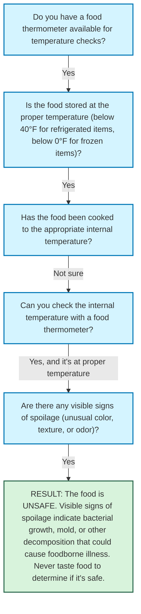

# Decision Path Analysis

Generated from: `food_safety.txt`  
Date: 2025-03-22 11:58:06

## Decision Path Tree

```
└── Do you have a food thermometer available for temperature checks?
└── Yes
    └── Is the food stored at the proper temperature (below 40°F for refrigerated items, below 0°F for frozen items)?
    └── Yes
        └── Has the food been cooked to the appropriate internal temperature?
        └── Not sure
            └── Can you check the internal temperature with a food thermometer?
            └── Yes, and it's at proper temperature
                └── Are there any visible signs of spoilage (unusual color, texture, or odor)?
                └── Yes
                    └── RESULT: The food is UNSAFE. Visible signs of spoilage indicate bacterial growth, mold, or other decomposition that could cause foodborne illness. Never taste food to determine if it's safe.
```

## Visual Diagram


