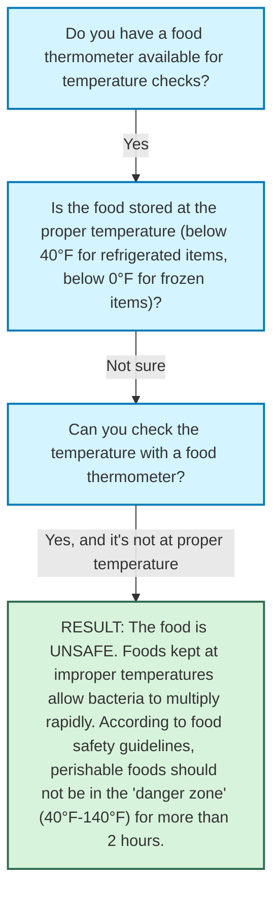

# Decision Path Analysis

Generated from: `food_safety.txt`  
Date: 2025-03-22 13:05:08

## Decision Path Tree

```
└── Do you have a food thermometer available for temperature checks?
└── Yes
    └── Is the food stored at the proper temperature (below 40°F for refrigerated items, below 0°F for frozen items)?
    └── Not sure
        └── Can you check the temperature with a food thermometer?
        └── Yes, and it's not at proper temperature
            └── RESULT: The food is UNSAFE. Foods kept at improper temperatures allow bacteria to multiply rapidly. According to food safety guidelines, perishable foods should not be in the "danger zone" (40°F-140°F) for more than 2 hours.
```

## Visual Diagram


