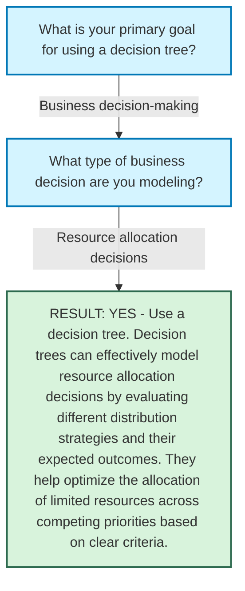

# Decision Path Analysis

Generated from: `use-a-decision-tree-yes-or-no.txt`  
Date: 2025-03-22 12:17:12

## Decision Path Tree

```
└── What is your primary goal for using a decision tree?
└── Business decision-making
    └── What type of business decision are you modeling?
    └── Resource allocation decisions
        └── RESULT: YES - Use a decision tree. Decision trees can effectively model resource allocation decisions by evaluating different distribution strategies and their expected outcomes. They help optimize the allocation of limited resources across competing priorities based on clear criteria.
```

## Visual Diagram


